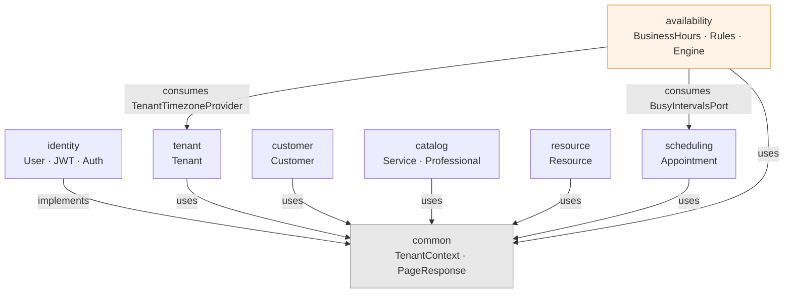
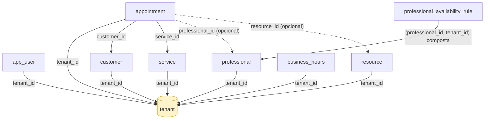

# SmartScheduller

Plataforma SaaS multi-tenant de agendamento e CRM. Genérica o suficiente para atender barbearias, salões, clínicas, consultórios, estúdios, academias, oficinas e qualquer negócio baseado em reservas — sem modelar conceitos específicos de um segmento (não existe `Barber`/`Haircut`/`Chair` no código, existe `Professional`/`Service`/`Resource`).

## Status

**V1 funcional**: multi-tenancy, autenticação, CRM básico (clientes), catálogo (serviços/profissionais/recursos), agendamento com prevenção de conflito, e motor de disponibilidade (cálculo de horários livres por profissional). Ainda não tem frontend — a API é o produto por enquanto.

## Stack

- **Java 25** / **Spring Boot 4.1.0** / Maven
- **PostgreSQL 16** (via Docker Compose) + **Flyway** para migrations versionadas
- **Spring Modulith 2.1.0** — fronteiras de módulo verificadas em tempo de teste (`ApplicationModules.verify()`)
- **Spring Security** com JWT (HMAC-SHA256) implementado sem biblioteca externa (evita conflito de Jackson 2 vs Jackson 3/`tools.jackson` de bibliotecas como `jjwt`)
- **springdoc-openapi 3.1.0** — Swagger UI / OpenAPI JSON
- **JUnit 5 + Mockito + AssertJ + Testcontainers** — todo módulo tem testes de domínio (unitário puro), de repositório (Postgres real via Testcontainers) e de controller (MockMvc + JWT real)

## Arquitetura

**Monólito modular**, não microservices. Cada módulo (`tenant`, `identity`, `customer`, `catalog`, `resource`, `scheduling`, `availability`) tem fronteira própria, verificada automaticamente pelo Spring Modulith — o build falha se um módulo acessar detalhes internos de outro.

Dois princípios seguidos à risca:

- **Multi-tenancy via schema compartilhado + `tenant_id`** (não schema-per-tenant — decisão deliberada, ver seção "Decisões de arquitetura" abaixo). Toda query relevante é escopada por tenant; nunca há um `findById` cru sem o tenant como parte da chave de busca.
- **Módulos se comunicam só por contrato, nunca por classe interna de outro módulo.** Onde um módulo precisa de dado de outro (ex: `availability` precisa do timezone do `tenant`, ou dos horários ocupados do `scheduling`), existe uma interface pequena na raiz do módulo fornecedor (`TenantTimezoneProvider`, `BusyIntervalsPort`) — nunca acesso direto a repositório/entidade interna. Onde a relação é só uma referência (ex: `Customer.tenantId`, `Appointment.professionalId`), é um UUID puro, com integridade garantida por **foreign key no banco**, não por chamada Java entre módulos.

### Módulos

| Módulo         | Responsabilidade                                                                                                                                                                  |
| -------------- | --------------------------------------------------------------------------------------------------------------------------------------------------------------------------------- |
| `tenant`       | Organização que usa a plataforma (`Tenant`: nome, slug, timezone, status)                                                                                                         |
| `identity`     | Autenticação: `User`, `Role` (ADMIN/MANAGER/PROFESSIONAL/RECEPTIONIST/VIEWER), JWT hand-rolled, `PasswordEncoder` (BCrypt)                                                        |
| `customer`     | Pessoa que usa os serviços do tenant — CRM base, sem custom fields ainda                                                                                                          |
| `catalog`      | `Service` (algo agendável) e `Professional` (quem executa um serviço)                                                                                                             |
| `resource`     | Recurso físico opcional que um agendamento pode reservar (sala, cadeira, equipamento)                                                                                             |
| `scheduling`   | `Appointment` — o núcleo do sistema, com prevenção de conflito de horário                                                                                                         |
| `availability` | `BusinessHours` (padrão do tenant), `ProfessionalAvailabilityRule` (override por profissional, com fallback automático pro padrão do tenant) e o motor de cálculo de slots livres |

### Diagrama de dependências entre módulos



Só existem duas dependências reais entre módulos de negócio (`availability → tenant` e `availability → scheduling`), e ambas passam por uma interface exposta na raiz do módulo fornecedor (`TenantTimezoneProvider`, `BusyIntervalsPort`) — nenhum módulo acessa classe interna de outro. `customer`, `catalog`, `resource` e `scheduling` não têm dependência Java entre si; a relação entre eles é só FK de banco (ver diagrama abaixo).

### Grafo de foreign keys



Todas as tabelas convergem pro `tenant` (schema compartilhado + `tenant_id`, ver "Decisões de arquitetura"). A única aresta com dois campos é a FK composta de `professional_availability_rule` — garante no banco que uma regra de disponibilidade não pode apontar pra um profissional de outro tenant.

### Multi-tenancy e contexto

O tenant da requisição **nunca** vem de algo que o cliente possa manipular livremente (nem header, nem body) — é resolvido a partir do JWT autenticado, via a interface `TenantContext` (implementada por `JwtTenantContext`). Todo controller de recurso tenant-scoped injeta `TenantContext` e nunca recebe `tenantId` como parâmetro de entrada do usuário.

## Rodando localmente

```bash
docker compose up -d db
mvn spring-boot:run -Dspring-boot.run.profiles=local
```

Variáveis de ambiente relevantes (ver `application.properties`):

```properties
JWT_SECRET=<segredo de pelo menos 32 bytes, obrigatório sobrescrever fora de dev>
```

### Fluxo básico pra testar

```bash
# 1. Cria um tenant (endpoint aberto - problema do ovo e da galinha, ver "Limitações conhecidas")
curl -X POST http://localhost:8080/api/v1/tenants \
  -H "Content-Type: application/json" \
  -d '{"name":"Barbearia do Zé","slug":"barbearia-do-ze","timezone":"America/Sao_Paulo"}'

# 2. Cria um usuário admin pro tenant (também aberto por enquanto)
curl -X POST http://localhost:8080/api/v1/tenants/{tenantId}/users \
  -H "Content-Type: application/json" \
  -d '{"name":"Admin","email":"admin@example.com","password":"senha12345","role":"ADMIN"}'

# 3. Login
curl -X POST http://localhost:8080/api/v1/auth/login \
  -H "Content-Type: application/json" \
  -d '{"email":"admin@example.com","password":"senha12345"}'
# -> devolve um token JWT

# 4. Usa o token em qualquer outro endpoint
curl http://localhost:8080/api/v1/customers -H "Authorization: Bearer <token>"
```

## Documentação da API

Com a aplicação rodando:

- OpenAPI JSON: `http://localhost:8080/v3/api-docs`
- Swagger UI: verificar o path exato no log de boot (springdoc 3.x anuncia automaticamente onde a UI ficou disponível)

## Testes

```bash
mvn test
```

Os testes de integração (`*IT.java`) sobem um Postgres **efêmero** via Testcontainers automaticamente — não precisa do `docker compose up` rodando pra isso, só Docker disponível na máquina/CI. Todo módulo segue o mesmo padrão de cobertura:

- Domínio (regras de negócio no agregado) — unitário, sem Spring
- Service — unitário, com repositório mockado (Mockito)
- Repository — integração, Postgres real, sempre com pelo menos um teste provando isolamento entre tenants
- Controller — integração, MockMvc + JWT real (não header solto), cobrindo o fluxo HTTP completo + casos de erro (404, 409, 400, 401)
- `ModularityTests` — valida os boundaries dos módulos (`ApplicationModules.verify()`)

## Decisões de arquitetura

Registradas aqui porque já foram deliberadas e descartadas conscientemente — não são esquecimento:

- **Schema compartilhado + `tenant_id`, não schema-per-tenant.** Schema-per-tenant multiplica migrations, complica pool de conexão, e degrada o catalog do Postgres em escala (muitos tenants pequenos = muitas relations). Candidato a hardening futuro: Postgres Row-Level Security (RLS) como camada extra de defesa, mantendo o schema compartilhado.
- **JWT implementado à mão (HMAC-SHA256 + JDK puro), não `jjwt`/Nimbus.** Evita dependência de bibliotecas ainda não validadas contra a combinação Boot 4 / Jackson 3 (`tools.jackson`) / Java 25 — stack recente o bastante pra já termos levado um bug real de compatibilidade (Spring Modulith 2.x + Hibernate 7 na tabela `event_publication`, resolvido removendo `spring-modulith-starter-jpa`, que não estava sendo usado de verdade ainda).
- **Sem motor de regras (Drools) para disponibilidade.** Cálculo de slots livres é aritmética de intervalos determinística, não correspondência de regras de negócio mutáveis — Drools seria complexidade e uma dependência pesada sem benefício real, com risco de compatibilidade adicional na mesma stack recente citada acima.
- **FK composta `(professional_id, tenant_id)`** em `professional_availability_rule` — garante no banco que uma regra de disponibilidade não pode ser vinculada a um profissional de outro tenant, sem o módulo `availability` precisar depender de classes Java do `catalog`.
- **Sem microservices.** Módulos com fronteira clara via Spring Modulith preparam extração futura _se_ houver gargalo real identificado — extrair cedo demais joga fora a vantagem de já termos essa fronteira desenhada hoje.

## Limitações conhecidas (dívida técnica intencional)

- **Autorização é só autenticação, ainda não é granular.** Qualquer usuário logado, seja `VIEWER` ou `ADMIN`, pode fazer qualquer operação — a `Role` está no token mas não há checagem de `Permission` por endpoint ainda.
- **Bootstrap aberto.** `POST /api/v1/tenants` e `POST /api/v1/tenants/{id}/users` não exigem autenticação (problema do ovo e da galinha — precisa existir um jeito de criar o primeiro admin). Fica aberto até existir um fluxo de onboarding real.
- **`Appointment` não usa FK composta** pro `professionalId`/`resourceId` (só existência, não pertencimento ao tenant certo) — o padrão que já aplicamos em `professional_availability_rule` ainda não foi retroaplicado aqui.
- **Sem frontend ainda.**

## Roadmap

- [ ] Autorização granular por `Permission`
- [ ] Fechar os endpoints de bootstrap (fluxo de convite/onboarding)
- [ ] Composite FK `(professional_id, tenant_id)` e `(resource_id, tenant_id)` em `Appointment`
- [ ] Row-Level Security como hardening adicional de isolamento
- [ ] CRM (notas, tags, timeline do customer)
- [ ] Notificações (email/push/WhatsApp) e automação (workflows)
- [ ] Frontend (Next.js + shadcn/ui + react-big-calendar)

## Licença

MIT LICESNSE
